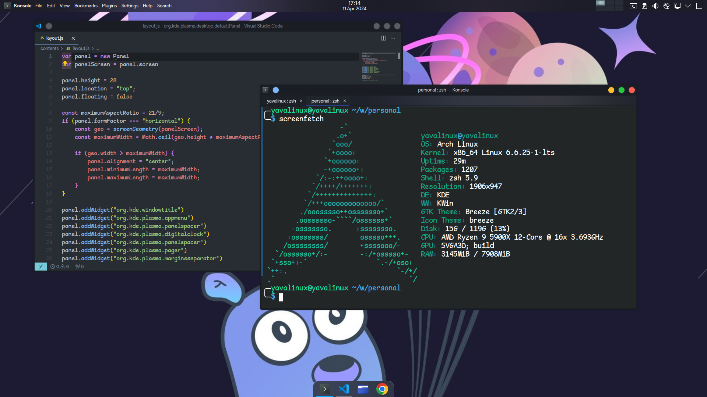

# Ainyava-KDE

### How to use

##### Using make (all linux distributions)
- Install `make` based on your distro.
- Install the themes: `make install`

##### using makepkg (ArchLinux)
- Install the requirements: `sudo pacman -S base-devel`
- Build and install the package `makepkg -si`

